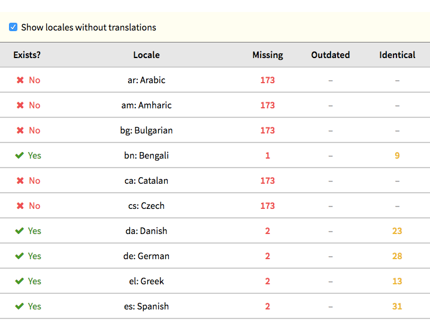
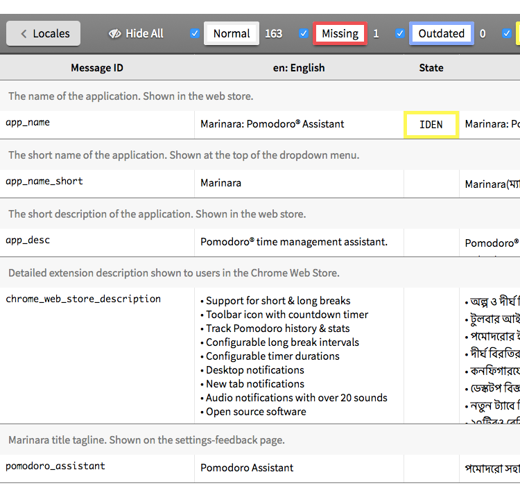

# Chrome Extension Localization

Chrome Extension Localization helps you organize and manage the process of localizing your Chrome extension
via [Travis CI](https://travis-ci.org/) automatic deployments and [GitHub Pages](https://pages.github.com/) hosting.

[Try the live example site](https://schmich.github.io/marinara-localization) or [read the translation guide](#translation-guide).

## Overview

Changes to your localized `messages.json` files trigger a Travis CI deployment to an auxiliary GitHub repo you
control. That repo is hosted with GitHub Pages and serves up message localization information. Translators
can use the site to add and update translations. To complete the cycle, the site helps translators create
GitHub pull requests for their changes.

### Workflow

1. Translator makes a change to a localization file, e.g. `_locales/es/messages.json`
2. Translator commits changes and pushes them to your extension repo on GitHub
3. Travis CI clones your repo and creates a localization summary file called `locales.json`
4. Travis CI commits and pushes `locales.json` to your extension localization repo on GitHub
5. GitHub serves your extension localization repo as a GitHub Pages website
6. Translators use your localization website to add and update translations

<p align="center"></p>

## Setup Guide

This tool was created to help localize the [Marinara](https://github.com/schmich/marinara) Chrome extension.
The following walkthrough will use `marinara` as the example project name and `schmich` as the example user name.

1. [Create a new GitHub repo](https://github.com/new) called `marinara-localization`. It will serve as the GitHub Pages host for the localization website:

<p align="center"></p>

2. Clone `marinara-localization`:

```
/src$ git clone git@github.com:schmich/marinara-localization && cd marinara-localization
```

3. Add `chrome-extension-localization` as a submodule:

```
/src/marinara-localization$ git submodule add https://github.com/schmich/chrome-extension-localization
```

4. Create a symbolic link to `index.html` for GitHub Pages:

```
/src/marinara-localization$ ln -s chrome-extension-localization/web/index.html .
```

5. Commit and push your changes:

```
/src/marinara-localization$ git commit -am 'Initial commit.' && git push
```

6. Enable GitHub Pages on the master branch for `marinara-localization` at https://github.com/schmich/marinara-localization/settings:

<p align="center"></p>

7. In your extension source (`marinara`) create a folder called `deploy`:

```
/src/marinara$ mkdir deploy && cd deploy
```

8. Add `chrome-extension-localization` as a submodule:

```
/src/marinara/deploy$ git submodule add https://github.com/schmich/chrome-extension-localization
```

9. Create a dedicated deployment key for deploying from Travis to the `marinara-localization` repo:

```
/src/marinara/deploy$ ssh-keygen -t rsa -b 4096 -C "Travis CI Deployment Key" -f deploy_key
Generating public/private rsa key pair.
Enter passphrase (empty for no passphrase): 
Enter same passphrase again: 
Your identification has been saved in deploy_key.
Your public key has been saved in deploy_key.pub.
The key fingerprint is:
SHA256:nY5jLr0JFgOZfBp1N/hLPiPj7jIT9K4vGYwT/PubevI Travis CI Deployment Key
...
```

10. Add `deploy_key` to your `.gitignore`. It's a private key that should *never* be committed to your repo:

```
/src/marinara/deploy$ echo deploy_key >> ../.gitignore
```

11. Add the contents of `deploy_key.pub` as a deployment key for `marinara-localization` at https://github.com/schmich/marinara-localization/settings/keys *(example key shown)*:

<p align="center"></p>
<p align="center"></p>

12. Install the Travis command-line tool:

```
/src/marinara/deploy$ gem install travis
Fetching: travis-1.8.8.gem (100%)
Successfully installed travis-1.8.8
Parsing documentation for travis-1.8.8
Installing ri documentation for travis-1.8.8
Done installing documentation for travis after 2 seconds
1 gem installed
```

13. Enable Travis builds for `marinara`:

```
/src/marinara/deploy$ travis enable
schmich/marinara: enabled :)
```

14. Copy the Travis configuration template into `marinara`:

```
/src/marinara/deploy$ (cd .. && curl -LO "https://raw.githubusercontent.com/schmich/chrome-extension-localization/master/deploy/.travis.yml")
```

15. Edit `.travis.yml` and change `COMMIT_AUTHOR_NAME`, `COMMIT_AUTHOR_EMAIL`, and `LOCALES_PATH`. `LOCALES_PATH` is the
relative path from your repo root to your `_locales` folder where your translations are stored:

```yaml
script: true
env:
  global:
  - COMMIT_AUTHOR_NAME: "'Chris Schmich'"
  - COMMIT_AUTHOR_EMAIL: schmch@gmail.com
  - LOCALES_PATH: src/_locales
...
```

16. Encrypt the deployment key with Travis. The tool will create an encrypted version of the deployment private key, `deploy_key.enc`:

```
/src/marinara/deploy$ travis encrypt-file deploy_key --add
encrypting deploy_key for schmich/marinara
storing result as deploy_key.enc
storing secure env variables for decryption

Make sure to add deploy_key.enc to the git repository.
Make sure not to add deploy_key to the git repository.
Commit all changes to your .travis.yml.
```

17. Verify Travis settings at https://travis-ci.org/schmich/marinara/settings. Ensure the `encrypted_*_iv` and `encrypted_*_key` environment variables are present:

<p align="center"></p>

18. Add the deployment files to `marinara`:

```
/src/marinara/deploy$ git add chrome-extension-localizatoin deploy_key.{enc,pub} ../.{travis.yml,gitignore}
```

19. Commit and push the new files:

```
/src/marinara/deploy$ git commit && git push
```

20. Your push will trigger Travis to build and deploy `marinara`. Monitor progress at https://travis-ci.org/schmich/marinara:

<p align="center"></p>
<p align="center"></p>

21. Travis' deployment step will generate `locales.json` which will be committed and pushed to the `marinara-localization` repo:

<p align="center"></p>

22. GitHub will publish the localization site to https://schmich.github.io/marinara-localization. This site can be used to manage localization for your extension:

<p align="center"></p>
<p align="center"></p>

## Updating Submodules

Both your `extension` and `extension-localization` projects link to `chrome-extension-localization` as a git
submodule. You can periodically update your submodule references to get the latest features and bug fixes.

When updating, ensure that you reference the same submodule version (commit hash) in both projects:

```
/src/marinara$ git submodule update --remote deploy/chrome-extension-localization
Submodule path 'deploy/chrome-extension-localization': checked out 'dab0105375efef675ee06b943e40d5fcbfc704bd'
```

```
/src/marinara-localization$ git submodule update --remote chrome-extension-localization
Submodule path 'chrome-extension-localization': checked out 'dab0105375efef675ee06b943e40d5fcbfc704bd' 
```

## Translation Guide

You need a [GitHub account](https://github.com/join) to create pull requests for your translations.

1. Open the project localization website, e.g. https://schmich.github.io/marinara-localization/

2. Select the locale to update or create. If a locale doesn't exist, that means there is no corresponding
`messages.json` file for it yet. You can be the first to translate for it:

<p align="center"></p>

3. On the translation page, you will see a table of messages used in the extension. As you add and update 
translations, the app will save your work locally in-browser. Each message has a few properties:

    - *Message ID* is the programmatic ID used in the extension
    - *en: English* is the source English message
    - *State* indicates any issues with the message (see below)
    - *es: Spanish* is the editable translation

<p align="center"></p>

4. Messages can contain placeholders which the extension determines at runtime. For example, the message `Hello, $name$!` has `$name$` as a placeholder. Use the placeholder in your translation, but do not translate the placeholder itself. In this case, the Spanish translation would be `¡Hola, $name$!`.

5. Message states indicate potential translation issues. You can show or hide messages based on these states:

    - *Normal*: Messages without any issues
    - *Missing*: Messages that have not been translated; they need translating
    - *Outdated*: Messages with English counterparts that changed since translation; the translation might need updating to reflect the English changes
    - *Identical*: Messages that are identical to their English counterparts; they might need translating

<p align="center"></p>

6. Once you have finished adding and updating translations, export your work to a JSON-formatted
`messages.json` file. This file contains all translations for the locale and will be bundled with the extension.

<p align="center"></p>

7. Click the GitHub link to start the pull request process to contribute your translations. If you haven't
forked the extension repository already, you will be prompted to do so:

<p align="center"></p>

8. Paste from your clipboard or copy-paste the contents of the downloaded `messages.json` file and propose your changes:

<p align="center"></p>
<p align="center"></p>
<p align="center"></p>

9. That's it! Wait for the maintainer to merge your pull request:

<p align="center"></p>

## License

Copyright &copy; 2017 Chris Schmich  
MIT License. See [LICENSE](LICENSE) for details.
